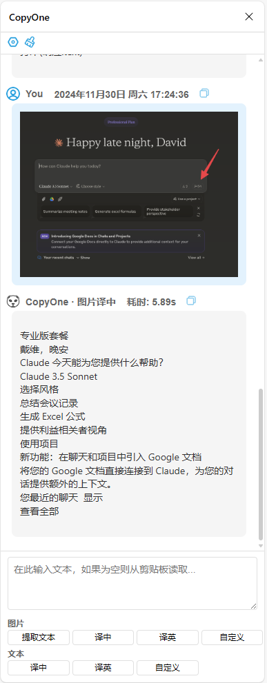
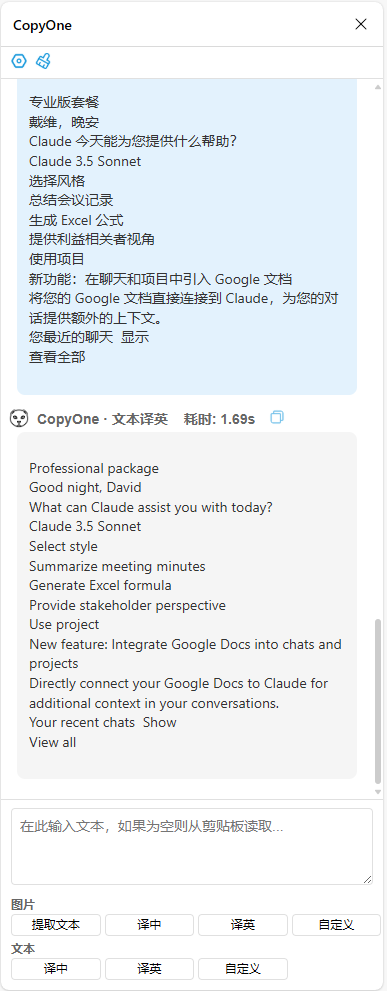
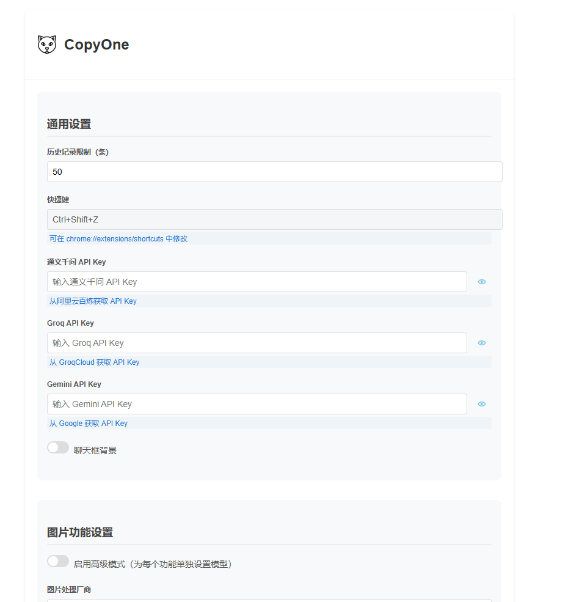

# 首复 (CopyOne) - 智能剪贴板助手

[中文](README.md) | [English](README_en.md)

首复是一个强大的浏览器扩展，它可以帮助你快速处理剪贴板中的图片和文本内容。无论是提取图片中的文本、翻译内容，还是自定义处理，首复都能帮你轻松完成。

## 计划更新

- [ ] 支持更多 AI 服务商（Claude、ChatGPT）
- [ ] 支持 OpenAI 兼容接口
- [ ] 多语言支持

## 功能展示

### 图片处理

### 文本处理

### 设置界面

## 主要功能

### 图片处理
- **提取文本**：从图片中提取文字内容
- **译中**：将图片中的文字翻译成中文
- **译英**：将图片中的文字翻译成英文
- **自定义**：使用自定义提示词处理图片

### 文本处理
- **译中**：将文本翻译成中文
- **译英**：将文本翻译成英文
- **自定义**：使用自定义提示词处理文本

## 特色功能

- 🚀 支持多个 AI 服务商（通义千问、Groq、Gemini）
- 💾 自动保存历史记录
- 🎨 可自定义聊天界面背景
- ⌨️ 支持快捷键操作
- 📝 支持 Markdown 格式
- 🔄 支持流式响应
- ⚙️ 高级模式支持为每个功能单独配置

## 安装说明

1. 下载项目代码
2. 打开 Chrome 浏览器，进入扩展管理页面 (`chrome://extensions/`)
3. 开启"开发者模式"
4. 点击"加载已解压的扩展程序"
5. 选择项目文件夹

## 使用方法

1. 点击浏览器工具栏中的 CopyOne 图标或使用快捷键（默认 Ctrl+Shift+Z）打开侧边栏
2. 复制需要处理的图片或文本到剪贴板
3. 在侧边栏中选择相应的处理功能
4. 等待处理结果

## 配置说明

### 基础配置
- **历史记录限制**：设置保存的历史记录数量
- **API Keys**：配置各个服务商的 API 密钥
- **聊天框背景**：开启/关闭聊天消息的背景色

### 高级配置
- **图片处理**：可为每个图片处理功能单独配置
  - 选择服务商
  - 选择模型
  - 自定义提示词
- **文本处理**：可为每个文本处理功能单独配置
  - 选择服务商
  - 选择模型
  - 自定义提示词

## 支持的服务商和模型

- 通义千问
- Groq
- Gemini

## 快捷键

- 打开/关闭侧边栏：`Ctrl+Shift+Z`（Mac: `Command+Shift+Z`）
- 保存设置：`Ctrl+S`（Mac: `Command+S`）

## 注意事项

1. 使用前需要配置相应服务商的 API Key
2. 部分功能需要剪贴板访问权限
3. 建议使用最新版本的 Chrome 浏览器或 Edge 浏览器

## 隐私说明

- 所有数据均存储在本地
- 不会收集任何用户隐私信息
- API 调用直接与服务商通信

## 许可证

MIT License

## 问题反馈

如果你在使用过程中遇到任何问题，或有任何建议，欢迎提出 Issue。